# Ficha técnica | Super Caja

## Índice
- [Dashboard](#veja-o-dashboard)
- [Ferramentas](#ferramentas)
- [Caso](#caso)
- [Objetivos](#objetivos)
- [Inspecionar Tabelas](#inspecionar-tabelas)
- [Novas Tabelas](#novas-tabelas-big-query)
- [Risco Relativo](#risco-relativo)
- [Hipóteses](#hipóteses)
- [Segmentação](#segmentação)
- [Regressão Logística](#regressão-logística)
- [Análise Exploratória](#análise-exploratória)
- [Links Importantes](#links-importantes)

## Veja o Dashboard
📍 Para acessar o dashboard do projeto, [clique aqui](https://lookerstudio.google.com/reporting/789f2de1-bc5c-4de6-878f-d3f385a91191).

## Ferramentas
- BigQuery: Gerenciamento de dados usando a linguagem SQL.
- Looker Studio: Para visualização de dados.
- Google Colab (Python): Para realizar analisar as tabelas e aplicar regressão logística.
- Notion: Para organização e documentação.

## Caso
Num contexto recente, a descida das taxas de juro no mercado desencadeou um aumento notável na demanda por pedidos de crédito. Os clientes viram este movimento do mercado, como uma oportunidade favorável para financiar grandes compras ou consolidar dívidas existentes, o que elevou o fluxo de pedidos de empréstimo no banco “Super Caja”.  
A equipe de análise de crédito do banco enfrenta um fardo esmagador devido à análise manual necessária para cada solicitação de empréstimo de clientes individuais. Esta metodologia manual resultou num processo ineficiente e atrasado, que afetou negativamente a eficiência e a velocidade com que os pedidos de empréstimo são processados. A situação tornou-se mais crítica devido à preocupação crescente com a taxa de inadimplência, um problema que afeta cada vez mais o setor financeiro, e aumenta a pressão sobre os bancos para identificar e mitigar riscos associados ao crédito.  
Para enfrentar esse desafio, a proposta do banco é a automação do processo de análise de crédito usando técnicas de análise avançadas de dados, com o objetivo de melhorar a eficiência, precisão e rapidez na avaliação de pedidos de crédito. Além disso, o banco já tem uma métrica para identificar clientes com pagamento atrasado, o que poderia ser uma ferramenta valiosa para integrar na classificação de risco no novo sistema automatizado.

## Objetivos

O banco Super Caja precisa tomar decisões informadas sobre a quem conceder crédito, reduzindo assim o risco de empréstimos não reembolsáveis. Pensando nisso, os objetivos dessa análise foram:

### Objetivo geral:

→ Segmentar os clientes em 2 grupos, um grupo com clientes com alto risco de inadimplência, e um outro grupo com clientes com risco comum de inadimplência.

### Objetivos específicos:

→ Avaliar o risco relativo;

→ Identificar o perfil de clientes com risco de inadimplência;

→ Montar uma pontuação de crédito através da análise de dados.

## Inspecionar Tabelas
📌 O 1º passo foi inspecionar o banco de dados, conhecer melhor as tabelas originais, as variáveis, os tipos de dados, a quantidade de linhas, os valos nulos e duplicados etc.

**Índice:**  
[Tabela default](#️-tabela-default)  
[Tabela loans_detail](#️-tabela-loans_detail)  
[Tabela loans_outstanding](#️-tabela-loans_outstanding)  
[Tabela user_info](#️-tabela-user_info)

### 🗒️ Tabela default
---

#### Insumos
| TABELA | COLUNA | TIPO | CONTEÚDO |
| ------ | ------ | ---- | -------- |
| default | user id | integer | Número de identificação do cliente |
|  | default flag | integer | Classificação dos clientes inadimplentes (1 para clientes já registrados alguma vez como inadimplentes, 0 para clientes sem histórico de inadimplência) |

#### Nulos e duplicados
| — | VALORES |
| --- | --- |
| Total de linhas | 36000 |
| Valores nulos | 0 |
| Duplicados (user_id) | 0 |

### 🗒️ Tabela loans_detail
---

#### Insumos
| TABELA | COLUNA | TIPO | CONTEÚDO |
| --- | --- | --- | --- |
| loans_detail | user id | integer | Número de identificação do cliente |
|  | more 90 days overdue | integer | Número de vezes que o cliente apresentou atraso superior a 90 dias |
|  | using lines not secured personal assets | float | Quanto o cliente está utilizando em relação ao seu limite de crédito, em linhas que não são garantidas por bens pessoais, como imóveis e automóveis |
|  | number times delayed payment loan 30 59 days | integer | Número de vezes que o cliente atrasou o pagamento de um empréstimo (entre 30 e 59 dias) |
|  | debt ratio | float | Relação entre dívidas e ativos do cliente. Taxa de endividamento = Dívidas / Patrimonio |
|  | number times delayed payment loan 60 89 days | integer | Número de vezes que o cliente atrasou o pagamento de um empréstimo (entre 60 e 89 dias) |

#### Nulos e duplicados
| — | VALORES |
| --- | --- |
| Total de linhas | 36000 |
| Valores nulos | 0 |
| Duplicados (user_id) | 0 |

### 🗒️ Tabela loans_outstanding
---

#### Insumos
| TABELA | COLUNA | TIPO | CONTEÚDO |
| --- | --- | --- | --- |
| loans_outstanding | loan id | integer | Número de identificação do empréstimo (único para cada empréstimo) |
|  | user id | integer | Número de identificação do cliente |
|  | loan type | string | Tipo de empréstimo (real state = imóveis, others= outros) |

#### Nulos e duplicados
| — | VALORES |
| --- | --- |
| Total de linhas | 305335 |
| Valores nulos | 0 |
| Duplicados (loan id) | 0 |

#### Valores inconsistentes em variáveis categóricas
| COLUNA | VALORES | AÇÕES |
| --- | --- | --- |
| loan_type | other,others, real estate, REAL ESTATE | Padronizar em maiúsculas ou minúsculas. |
| loan_type | other,others, real estate, REAL ESTATE | Trocar others por other. ✅ |

### 🗒️ Tabela user_info
---

#### Insumos
| TABELA | COLUNA | TIPO | CONTEÚDO |
| --- | --- | --- | --- |
| user_info | user id | integer | Número de identificação do cliente (único para cada cliente) |
|  | age | integer | Idade do cliente |
|  | sex | string | Gênero do cliente |
|  | last month salary | float | Último salário mensal que o cliente informou ao banco |
|  | number dependents | integer | Número de dependentes |

#### Nulos e duplicados
| — | VALORES |
| --- | --- |
| Total de linhas | 36000 |
| Valores nulos | last_month_salary: 7199 (19.99%) |
| Valores nulos | number_dependents: 943 (2.61%) |
| Duplicados (user_id) | 0 |

#### Mais informações sobre nulos:
| TABELA | TOTAL DE NULOS | INADIMPLENTES |
| --- | --- | --- |
| user_info | last_month_salary: 7199 (19.99%) | 130 clientes já registrados alguma vez como inadimplentes não tem registro do último salário. |
| user_info | number_dependents: 943 (2.61%) | 10 clientes  já registrados alguma vez como inadimplentes não tem registro do número de dependentes. |

## Novas Tabelas (Big Query)

📌 Nesta seção estão informações sobre as novas tabelas e variáveis, que foram criadas a partir das tabelas originais. Aqui também estão algumas observações e ações pensadas a partir da análise dessas tabelas.  

**Índice**  
[Tabela customers](#️-tabela-customers)  
[Tabela total_loans_by_type](#️-tabela-total_loans_by_type)  
[Tabela customer_info_and_total_loans](#️-tabela-customer_info_and_total_loans)  
[Tabela customer_info_and_total_loans_notNull](#tabela-customer_info_and_total_loans_notnull)  
[Tabelas com dados sobre taxa de inadimplência e risco relativo](#tabelas-com-dados-sobre-taxa-de-inadimplência-e-risco-relativo)  
[Tabelas com segmentação](#tabelas-com-segmentação)  
[Tabela table_for_the_dashboard](#tabela-table_for_the_dashboard)

### 🗒️ Tabela customers
---

📌 Tabela com informações sobre os clientes (Total de linhas: 36000): União de colunas das tabelas user_info, default e loans_detail.

#### Insumos
| COLUNA | TIPO | CONTEÚDO |
| --- | --- | --- |
| user_id | INTEGER | Número de identificação do cliente (único para cada cliente) |
| age | INTEGER | Idade do cliente |
| number_dependents | INTEGER | Número de dependentes |
| last_month_salary | FLOAT | Último salário mensal que o cliente informou ao banco |
| default_flag | INTEGER | Classificação dos clientes inadimplentes (1 para clientes já registrados alguma vez como inadimplentes, 0 para clientes sem histórico de inadimplência) |
| number_times_delayed_payment_loan_30_59_days | INTEGER | Número de vezes que o cliente atrasou o pagamento de um empréstimo (entre 30 e 59 dias) |
| number_times_delayed_payment_loan_60_89_days | INTEGER | Número de vezes que o cliente atrasou o pagamento de um empréstimo (entre 60 e 89 dias) |
| more_90_days_overdue | INTEGER | Número de vezes que o cliente apresentou atraso superior a 90 dias |
| using_lines_not_secured_personal_assets | FLOAT | Quanto o cliente está utilizando em relação ao seu limite de crédito, em linhas que não são garantidas por bens pessoais, como imóveis e automóveis |
| debt_ratio | FLOAT | Relação entre dívidas e ativos do cliente. Taxa de endividamento = Dívidas / Patrimônio |

#### Correlação entre as variáveis da tabela
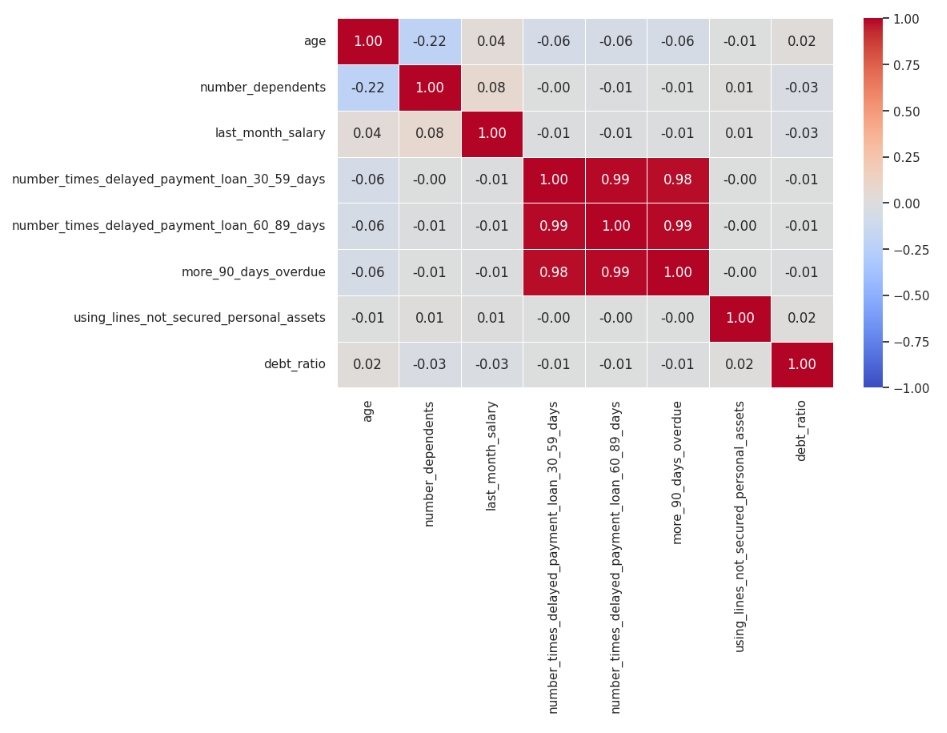  

📌 Alta correlação entre as variáveis:
- number_times_delayed_payment_loan_30_59_days
- number_times_delayed_payment_loan_60_89_days
- more_90_days_overdue  

#### Multicolinearidade
→ Análise das variáveis number_times_delayed_payment_loan_30_59_days, number_times_delayed_payment_loan_60_89_days, more_90_days_overdue.  

➡️ Notei um comportamento semelhante entre as variáveis.  

➡️ No gráfico acima é possível confirmar a semelhança no comportamento das variáveis referentes ao número de vezes que o cliente atrasou o pagamento de um empréstimo. Observando o gráfico especificamente do valor 0 até o valor 6, fica ainda mais evidente a semelhança na distribuição dos dados entre as 3 variáveis.

➡️ É possível notar que **number_times_delayed_payment_loan_60_89_days** tem menor variabilidade de valores e que **more_90_days_overdue** tem maior variabilidade de valores.  

⭐ Ação: Priorizar a variável more_90_days_overdue a fim de focar nos casos em que os clientes demoram mais tempo para pagar (nos casos em que os clientes são mais inadimplentes) e na variável que tem maior variabilidade de valores.  

### 🗒️ Tabela total_loans_by_type
---

📌 Tabela com informações sobre os empréstimos (Total de linhas: 35575): A tabela loans_outstanding foi usada para calcular o total de empréstimos de cada cliente.  

| COLUNA | TIPO | CONTEÚDO |
| --- | --- | --- |
| user_id | INTEGER | Número de identificação do cliente (único para cada cliente) |
| loan_type_other | INTEGER | Empréstimo do tipo other (outro) |
| loan_type_real_estate | INTEGER | Empréstimo do real estate (empréstimo imobiliário) |
| total_loans | INTEGER | Total de empréstimos dos 2 tipos (other e real estate) |

### 🗒️ Tabela customer_info_and_total_loans
---

📌 Tabela com informações sobre os clientes e sobre os empréstimos desses clientes (Total de linhas: 35575): União de colunas das tabelas customers e total_loans_by_type.

→ Ao unir as tabelas, optei por usar JOIN para unir apenas os IDs existentes nas 2 tabelas.  

| COLUNA | TIPO | CONTEÚDO | NULOS | AÇÕES (NULOS) | GRÁFICOS | OBSERVAÇÕES/AÇÕES (GRÁFICOS) |
| --- | --- | --- | --- | --- | --- | --- |
| user_id | INTEGER | Número de identificação do cliente (único para cada cliente) | 0 | -- | -- | -- |
| age | INTEGER | Idade do cliente | 0 | -- | Analisar com Box Plot | → A maior concentração de clientes está na faixa etária entre 21 e 92 anos. / → Veja customer_info_and_total_loans no https://colab.research.google.com/drive/1ioOjE1dbrBc6FtihS5xDqP6dr0jq97xU?usp=sharing / → Penso em usar apenas clientes com idade até 92 anos. |
| number_dependents | INTEGER | Número de dependentes | 910 (2.55%) | Percentual baixo de valores nulos, substituir pela moda (0) | Analisar com histograma | -- |
| last_month_salary | FLOAT | Último salário mensal que o cliente informou ao banco | 7032 (19.76%) | Substituir pela mediana | Analisar com Box Plot | → Excluir outlier muito extremo (1560100.0) está dificultando a visualização dos gráficos. / → ID Outlier: 21096 / → Veja customer_info_and_total_loans no https://colab.research.google.com/drive/1ioOjE1dbrBc6FtihS5xDqP6dr0jq97xU?usp=sharing |
| total_loans | INTEGER | Total de empréstimos dos 2 tipos (other e real estate) | 0 |  | Analisar com histograma |→ Outliers entre 21 e 57. / → 75% dos clientes tem um total de até 11 empréstimos. / → Veja customer_info_and_total_loans no https://colab.research.google.com/drive/1ioOjE1dbrBc6FtihS5xDqP6dr0jq97xU?usp=sharing |
| default_flag | INTEGER | Classificação dos clientes inadimplentes (1 para clientes já registrados alguma vez como inadimplentes, 0 para clientes sem histórico de inadimplência) | 0 |  | Gráfico de barras | -- |
| more_90_days_overdue | INTEGER | Número de vezes que o cliente apresentou atraso superior a 90 dias | 0 |  | Analisar com Box Plot | → Excluir o valor máximo (98), porque é muito maior do que o valor máximo que o antecede (15), e está dificultando a visualização dos gráficos. / → ID Outlier: 21979 / → Veja customer_info_and_total_loans no https://colab.research.google.com/drive/1ioOjE1dbrBc6FtihS5xDqP6dr0jq97xU?usp=sharing |
| using_lines_not_secured_personal_assets | FLOAT | Quanto o cliente está utilizando em relação ao seu limite de crédito, em linhas que não são garantidas por bens pessoais, como imóveis e automóveis | 0 |  | Analisar com Box Plot | -- |
| debt_ratio | FLOAT | Relação entre dívidas e ativos do cliente. Taxa de endividamento = Dívidas / Patrimônio | 0 |  | Analisar com Box Plot | → Excluir outlier muito extremo (307001.0) que está dificultando a visualização dos gráficos. / → ID Outlier: 18739 / → Veja customer_info_and_total_loans no https://colab.research.google.com/drive/1ioOjE1dbrBc6FtihS5xDqP6dr0jq97xU?usp=sharing |

#### Age
| Faixa de Idade | Total |
| --- | --- |
| Clientes com 90 anos ou mais | 179 (0.50%) |
| Clientes com 92 anos ou mais | 83 (0.23%) |
| Clientes com idade entre 90 e 92 anos | 121 |
| Clientes com mais de 92 anos | 58 |

#### Mediana de last_month_salary
→ Mediana: 5416.0

### Tabela customer_info_and_total_loans_notNull
---
📌 Cópia da tabela customer_info_and_total_loans com modificações (Total de linhas: 35514)

→ Os valores nulos da variável last_month_salary substituídos pela mediana.  
→ Na coluna last_month_salary_median os valores nulos de last_month_salary foram substituídos pela mediana.

| COLUNA | TIPO | CONTEÚDO |
| --- | --- | --- |
| last_month_salary_median | FLOAT | Último salário mensal que o cliente informou ao banco (livre de valores nulos / os valores nulos foram substituídos pela mediana). |

→ Na tabela customer_info_and_total_loans_notNull a coluna last_month_salary foi substituída pela coluna last_month_salary_median.  
→ As 3 linhas da imagem abaixo foram excluídas por conterem valores muito extremos que estavam dificultando a visualização dos gráficos, optei por excluir essas linhas porque eram apenas 3 linhas e a exclusão dessas linhas não impactou significativamente a análise dos dados.

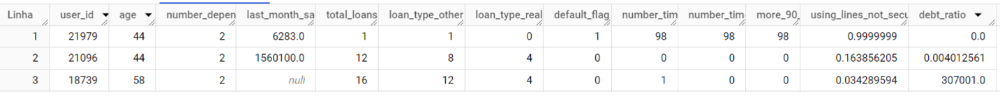

→ As linhas em que a variável age são maiores que 92 foram excluídas. Optei por excluir essas linhas porque queria que os meus quartis reunissem as idades com maior concentração de clientes. Além disso, a exclusão dessas linhas não impactou significativamente a análise.

#### Possíveis ações
| COLUNA | AÇÃO |
| --- | --- |
| user_id |  |
| age | Calcular risco relativo e validar hipótese (quartis) / → Grupo exposto: quartil em análise / → Grupo não exposto: demais quartis |
| number_dependents |  |
| last_month_salary_median |  |
| total_loans | Calcular risco relativo e validar hipótese (quartis) / → Grupo exposto: quartil em análise / → Grupo não exposto: demais quartis |
| default_flag |  |
| more_90_days_overdue | Calcular risco relativo e validar hipótese / → Grupo exposto: com atraso / → Grupo não exposto: sem atraso |
| using_lines_not_secured_personal_assets |  |
| debt_ratio |  |

### Tabelas com dados sobre taxa de inadimplência e risco relativo
---

📌 Tabelas com dados sobre taxa de inadimplência e dados sobre o risco relativo.
| COLUNA | CONTEÚDO |
| --- | --- |
| quartile / group_label | quartil / grupo |
| lower_limit | limite mínimo (valor mínimo) |
| upper_limit | limite mínimo (valor máximo) |
| total_customers | total de clientes |
| total_default | total de inadimplentes |
| default_rate | taxa de inadimplência do grupo exposto |
| default_rate_reference | taxa de inadimplência do grupo não exposto |
| default_rate_ratio | risco relativo |

### Tabelas com segmentação
---

#### risk_score
📌 Essa tabela contém informações da tabela customer_info_and_total_loans_notNull acrescida de informações sobre a pontuação de risco dos clientes. Para entender melhor sobre como as pontuações foram estabelecidas, ver a sessão Segmentação (especialmente a sessão Conclusões | 1ª segmentação).

| COLUNA | TIPO | CONTEÚDO |
| --- | --- | --- |
| user_id | INTEGER | Número de identificação do cliente (único para cada cliente) |
| age | INTEGER | Idade do cliente |
| number_dependents | INTEGER | Número de dependentes |
| last_month_salary | FLOAT | Último salário mensal que o cliente informou ao banco |
| total_loans | INTEGER | Total de empréstimos dos 2 tipos (other e real estate) |
| default_flag | INTEGER | Classificação dos clientes inadimplentes (1 para clientes já registrados alguma vez como inadimplentes, 0 para clientes sem histórico de inadimplência) |
| more_90_days_overdue | INTEGER | Número de vezes que o cliente apresentou atraso superior a 90 dias |
| using_lines_not_secured_personal_assets | FLOAT | Quanto o cliente está utilizando em relação ao seu limite de crédito, em linhas que não são garantidas por bens pessoais, como imóveis e automóveis |
| debt_ratio | FLOAT | Relação entre dívidas e ativos do cliente. Taxa de endividamento = Dívidas / Patrimônio |
| risk_age | INTEGER | Pontuação de risco para as faixas de idade |
| risk_dependents | INTEGER | Pontuação de risco para o número de dependentes |
| risk_salary | INTEGER | Pontuação de risco para o último salário mensal |
| risk_loans | INTEGER | Pontuação de risco para o total de empréstimos |
| risk_overdue | INTEGER | Pontuação de risco para o total de vezes em que o cliente atrasou um pagamento por mais de 90 dias |
| risk_lines_not_secured | INTEGER | Pontuação de risco referente a quanto o cliente utilizou em relação ao seu limite de crédito, em linhas que não são garantidas por bens pessoais, como imóveis e automóveis |
| risk_debt_ratio | INTEGER | Pontuação de risco para a taxa de endividamento |
| risk_score | INTEGER | Pontuação de risco total para cada cliente |
| segmentation | STRING | Segmentação entre “maior risco” e “menor risco" a partir da pontuação de corte |
| segmentation_num | INTEGER | Segmentação entre maior risco e menor risco usando o sistema de numeração binário, sendo 0 para menor risco e 1 para maior risco. |

#### risk_score_2

📌 Nessa tabela, as pontuações de risco foram atribuídas apenas para as variáveis more_90_days_overdue, using_lines_not_secured_personal_assets e debt_ratio. Para entender melhor sobre como as pontuações foram estabelecidas, ver a sessão Segmentação (especialmente a sessão Conclusões | 2ª segmentação).

| COLUNA | TIPO | CONTEÚDO |
| --- | --- | --- |
| user_id | INTEGER | Número de identificação do cliente (único para cada cliente) |
| age | INTEGER | Idade do cliente |
| number_dependents | INTEGER | Número de dependentes |
| last_month_salary | FLOAT | Último salário mensal que o cliente informou ao banco |
| total_loans | INTEGER | Total de empréstimos dos 2 tipos (other e real estate) |
| default_flag | INTEGER | Classificação dos clientes inadimplentes (1 para clientes já registrados alguma vez como inadimplentes, 0 para clientes sem histórico de inadimplência) |
| more_90_days_overdue | INTEGER | Número de vezes que o cliente apresentou atraso superior a 90 dias |
| using_lines_not_secured_personal_assets | FLOAT | Quanto o cliente está utilizando em relação ao seu limite de crédito, em linhas que não são garantidas por bens pessoais, como imóveis e automóveis |
| debt_ratio | FLOAT | Relação entre dívidas e ativos do cliente. Taxa de endividamento = Dívidas / Patrimônio |
| risk_overdue | INTEGER | Pontuação de risco para o total de vezes em que o cliente atrasou um pagamento por mais de 90 dias |
| risk_lines_not_secured | INTEGER | Pontuação de risco referente a quanto o cliente utilizou em relação ao seu limite de crédito, em linhas que não são garantidas por bens pessoais, como imóveis e automóveis |
| risk_debt_ratio | INTEGER | Pontuação de risco para a taxa de endividamento |
| risk_score | INTEGER | Pontuação de risco total para cada cliente |
| segmentation | STRING | Segmentação entre “maior risco” e “menor risco" a partir da pontuação de corte |
| segmentation_num | INTEGER | Segmentação entre maior risco e menor risco usando o sistema de numeração binário, sendo 0 para menor risco e 1 para maior risco. |

### Tabela table_for_the_dashboard
---

📌 Tabela feita com o propósito de ser utilizada no dashboard.  
→ O score de risco da tabela risk_score_2 foi usado como base.

| COLUNA | TIPO | CONTEÚDO |
| --- | --- | --- |
| ID dos Clientes | INTEGER | Identificador único para cada cliente |
| Inadimplência | STRING | Registro de clientes que já foram ou não inadimplentes |
| Idade | INTEGER | Idade dos clientes |
| Grupos Etários | STRING | Grupos por faixa etária |
| Total de Dependentes | INTEGER | Número de dependentes |
| Dependentes | STRING | Faixas por número de dependentes |
| Último Salário Mensal | FLOAT | Valor do último salário mensal |
| Faixa do Último Salário | STRING | Faixas por valor do último salário mensal |
| Total de Empréstimos | INTEGER | Total de empréstimos |
| Empréstimos | STRING | Faixas por total empréstimos |
| Total de Atrasos | INTEGER | Total de atrasos de pagamentos por mais de 90 dias |
| Registro de Atraso | STRING | Registro de clientes que já atrasaram ou não seus pagamentos por mais de 90 dias |
| Total de Uso do Limite de Crédito | FLOAT | Valor total usado do limite de crédito em linhas que não são garantidas por bens pessoais |
| Uso do Limite de Crédito | STRING | Registro de clientes que usaram mais que 0.60 do limite de crédito e dos clientes que usaram menos que 0.60 do limite de crédito |
| Total da Taxa de Endividamento | FLOAT | Valor total da taxa de endividamento dos clientes |
| Taxa de Endividamento | STRING | “Taxa positiva” para clientes com taxa de endividamento maior que 0 / “Taxa nula” para clientes com taxa de endividamento menor que 0 |
| Pontuação de Risco para Atrasos | INTEGER | Pontuação de risco 1 para clientes que já atrasaram os seus pagamentos por mais de 90 dias / Pontuação 0 para clientes que nunca atrasaram |
| Pontuação de Risco para Uso das Linhas de Crédito | INTEGER | Pontuação de risco 1 para clientes que usaram mais que 0.60 do limite de crédito / Pontuação 0 para clientes que usaram menos que 0.60 do limite de crédito |
| Pontuação de Risco para Taxa de Endividamento | INTEGER | Pontuação de risco 1 para clientes com taxa de endividamento maior que 0 / Pontuação 0 para clientes com taxa de endividamento menor que 0 |
| Score de Risco de Inadimplência | INTEGER | Somatório das variáveis: Pontuação de Risco para Atrasos; Pontuação de Risco para Uso das Linhas de Crédito; Pontuação de Risco para Taxa de Endividamento |
| Segmentação por Risco de Inadimplência | STRING | “Risco comum” para clientes com Score de Risco de Inadimplência menor que 6 / “Maior risco” para clientes com Score de Risco de Inadimplência igual a 6 |
| Outros_Emprestimos | INTEGER | Total de outros empréstimos realizados por cada cliente |
| Emprestimos_Imobiliarios | INTEGER | Total de empréstimos imobiliários realizados por cada cliente |

Essas tabelas também foram analisadas com Python e os registros estão em um Notebook do Google Colab, com informações sobre as tabelas, gráficos, regressão logística etc. Clique no link abaixo para ver.

https://colab.research.google.com/drive/1ioOjE1dbrBc6FtihS5xDqP6dr0jq97xU?usp=sharing

## Risco Relativo

Em consultas realizadas no BigQuery, usando SQL, foram feitos os cálculos necessários para obter as taxas de inadimplência e os riscos relativos para diferentes grupos, a partir das características dos clientes, como idade, número de dependentes, valor do último salário mensal, total de empréstimos, atrasos nos pagamentos por mais de 90 dias, uso do limite de crédito por linhas que não são garantidas por bens pessoais, e taxa de endividamento. 

→ A variável utilizada para avaliar o risco foi a default_flag, que tem registros sobre os clientes que já foram ou não inadimplentes.

Para fazer esses cálculos, foi necessário dividir a amostra em grupos, os dados foram agrupados por quartil ou grupo. As divisões dos grupos para análise do risco relativo foram pensadas, de maneira geral, a partir da comparação entre o 3° quartil (75%) e o valor máximo (max). Veja na tabela abaixo:

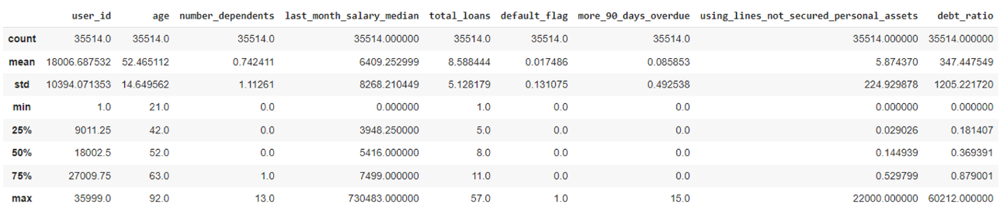

Os resultados obtidos e observações desses resultados estão nas listas abaixo:

→ Para entender melhor a estrutura das tabelas, acesse a seção Tabelas com dados sobre taxa de inadimplência e risco relativo em Minhas tabelas (Big Query).

### relative_risk_age (variável age)
Tabela com dados sobre a divisão dos clientes por grupos de idade (quartis), dados sobre a taxa de inadimplência e sobre o risco relativo desses grupos:

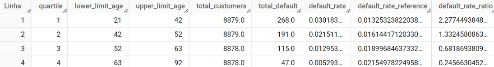

**Observações:**

🚩 Foi possível notar que os clientes mais jovens foram mais inadimplentes.   
→ A faixa etária de 21 a 42 anos apresentou risco relativo de 2.27.  
→ A faixa etária de 42 a 52 anos apresentou risco relativo de 1.33.

#### Código
```sql
WITH quartis AS (
    SELECT
        NTILE(4) OVER (ORDER BY age) AS quartile,
        age,
        default_flag
    FROM
        `riscorelativolab.join_tables.customer_info_and_total_loans_notNull`
),
total_clientes AS (
    SELECT
        quartile,
        COUNT(*) AS total_customers,
        SUM(default_flag) AS total_default,
        SUM(default_flag) / COUNT(*) AS default_rate
    FROM quartis
    GROUP BY quartile
),
total_calculo AS (
    SELECT
        COUNT(user_id) AS total_of_customers_general,
        SUM(default_flag) AS total_of_default_general
    FROM `riscorelativolab.join_tables.customer_info_and_total_loans_notNull`
)

SELECT
    q.quartile,
    Min(q.age) AS lower_limit_age,
    Max(q.age) AS upper_limit_age,
    AVG(t_c.total_customers) AS total_customers,
    AVG(t_c.total_default) AS total_default,
    AVG(default_rate) AS default_rate,
    MAX(t_calc.total_of_default_general - t_c.total_default) / MAX(t_calc.total_of_customers_general - t_c.total_customers) AS default_rate_reference,
    AVG(default_rate) / (MAX(t_calc.total_of_default_general - t_c.total_default) / MAX(t_calc.total_of_customers_general - t_c.total_customers)) AS default_rate_ratio
FROM quartis q
JOIN total_clientes t_c ON q.quartile = t_c.quartile
CROSS JOIN total_calculo t_calc
GROUP BY q.quartile
ORDER BY q.quartile;

```
        

### relative_risk_dependents (variável number_dependents)
Tabela com dados sobre a divisão dos clientes por grupo de pessoas que tinham até 1 dependente e por grupo de pessoas que tinham mais de 1 dependente, dados sobre a taxa de inadimplência e sobre o risco relativo desses grupos:


**Observações:**

🚩 Foi possível notar que os clientes com maior número de dependentes foram mais inadimplentes.  
→ Clientes com até 1 dependente apresentaram risco relativo de 0.64.  
→ Clientes com 2 ou mais dependentes apresentaram risco relativo de 1.55.

#### Código
```sql
WITH grupos AS (
    SELECT
        CASE
            WHEN number_dependents > 1 THEN 'dependents_2+'
            ELSE 'dependents_1-'
        END AS group_label,
        number_dependents,
        default_flag
    FROM
        `riscorelativolab.join_tables.customer_info_and_total_loans_notNull`
),
total_clientes AS (
    SELECT
        group_label,
        COUNT(*) AS total_customers,
        SUM(default_flag) AS total_default,
        SUM(default_flag) / COUNT(*) AS default_rate
    FROM grupos
    GROUP BY group_label
),
default_rates AS (
    SELECT
        group_label,
        default_rate
    FROM total_clientes
)
SELECT
    g.group_label,
    MIN(g.number_dependents) AS lower_limit_dependents,
    MAX(g.number_dependents) AS upper_limit_dependents,
    t_c.total_customers,
    t_c.total_default,
    t_c.default_rate,
    CASE 
        WHEN g.group_label = 'dependents_1-' THEN t_c.default_rate / (SELECT default_rate FROM default_rates WHERE group_label = 'dependents_2+')
        ELSE t_c.default_rate / (SELECT default_rate FROM default_rates WHERE group_label = 'dependents_1-')
    END AS rate_ratio
FROM grupos g
JOIN total_clientes t_c ON g.group_label = t_c.group_label
GROUP BY g.group_label, t_c.total_customers, t_c.total_default, t_c.default_rate
```

### relative_risk_salary (variável last_month_salary_median)

Tabela com dados sobre a divisão dos clientes por grupos de faixa de salário (quartis), dados sobre a taxa de inadimplência e sobre o risco relativo desses grupos:

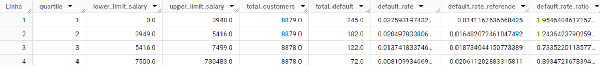

**Observações:**

🚩 Foi possível notar que os clientes que tiveram um valor menor de último salário mensal (last_month_salary) apresentaram risco relativo maior.  
→ Clientes com faixa de salário até 3948.0 apresentaram risco relativo de 1.95.  
→ Clientes com faixa de salário de 3949.0 até 5416.0 apresentaram risco relativo de 1.24.  
→ Clientes com faixa de salário de 5416.0 até 7499.0 apresentaram risco relativo de 0.73.  
→ Clientes com faixa de salário de 7500.0 até 730483.0 apresentaram risco relativo de 0.39.  

#### Código
```sql
WITH quartis AS (
    SELECT
        NTILE(4) OVER (ORDER BY last_month_salary_median) AS quartile,
        last_month_salary_median,
        default_flag
    FROM
        `riscorelativolab.join_tables.customer_info_and_total_loans_notNull`
),
total_clientes AS (
    SELECT
        quartile,
        COUNT(*) AS total_customers,
        SUM(default_flag) AS total_default,
        SUM(default_flag) / COUNT(*) AS default_rate
    FROM quartis
    GROUP BY quartile
),
total_calculo AS (
    SELECT
        COUNT(user_id) AS total_of_customers_general,
        SUM(default_flag) AS total_of_default_general
    FROM `riscorelativolab.join_tables.customer_info_and_total_loans_notNull`
)

SELECT
    q.quartile,
    Min(q.last_month_salary_median) AS lower_limit_salary,
    Max(q.last_month_salary_median) AS upper_limit_salary,
    AVG(t_c.total_customers) AS total_customers,
    AVG(t_c.total_default) AS total_default,
    AVG(default_rate) AS default_rate,
    MAX(t_calc.total_of_default_general - t_c.total_default) / MAX(t_calc.total_of_customers_general - t_c.total_customers) AS default_rate_reference,
    AVG(default_rate) / (MAX(t_calc.total_of_default_general - t_c.total_default) / MAX(t_calc.total_of_customers_general - t_c.total_customers)) AS default_rate_ratio
FROM quartis q
JOIN total_clientes t_c ON q.quartile = t_c.quartile
CROSS JOIN total_calculo t_calc
GROUP BY q.quartile
ORDER BY q.quartile;
```

### relative_risk_loans (variável total_loans)

Tabela com dados sobre a divisão dos clientes por grupos organizados por quantidade de empréstimos (quartis), dados sobre a taxa de inadimplência e sobre o risco relativo desses grupos:

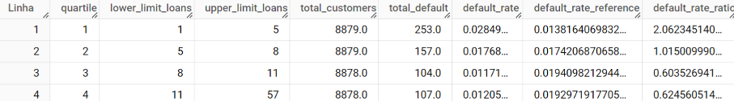

**Observações:**

🚩 Foi possível notar que os clientes com menos empréstimos foram mais inadimplentes.  
→ Clientes com total de empréstimos entre 1 e 5 apresentaram risco relativo de 2.06.  
→ Clientes com total de empréstimos entre 5 e 8 apresentaram risco relativo de 1.01.

#### Código
```sql
WITH quartis AS (
    SELECT
        NTILE(4) OVER (ORDER BY total_loans) AS quartile,
        total_loans,
        default_flag
    FROM
        `riscorelativolab.join_tables.customer_info_and_total_loans_notNull`
),
total_clientes AS (
    SELECT
        quartile,
        COUNT(*) AS total_customers,
        SUM(default_flag) AS total_default,
        SUM(default_flag) / COUNT(*) AS default_rate
    FROM quartis
    GROUP BY quartile
),
total_calculo AS (
    SELECT
        COUNT(user_id) AS total_of_customers_general,
        SUM(default_flag) AS total_of_default_general
    FROM `riscorelativolab.join_tables.customer_info_and_total_loans_notNull`
)

SELECT
    q.quartile,
    Min(q.total_loans) AS lower_limit_loans,
    Max(q.total_loans) AS upper_limit_loans,
    AVG(t_c.total_customers) AS total_customers,
    AVG(t_c.total_default) AS total_default,
    AVG(default_rate) AS default_rate,
    MAX(t_calc.total_of_default_general - t_c.total_default) / MAX(t_calc.total_of_customers_general - t_c.total_customers) AS default_rate_reference,
    AVG(default_rate) / (MAX(t_calc.total_of_default_general - t_c.total_default) / MAX(t_calc.total_of_customers_general - t_c.total_customers)) AS default_rate_ratio
FROM quartis q
JOIN total_clientes t_c ON q.quartile = t_c.quartile
CROSS JOIN total_calculo t_calc
GROUP BY q.quartile
ORDER BY q.quartile;

```

### relative_risk_more_90_days_overdue (variável more_90_days_overdue)

Tabela com dados sobre a divisão dos clientes por grupos de pessoas que atrasaram ou não o pagamento por mais de 90 dias, dados sobre a taxa de inadimplência e sobre o risco relativo desses grupos:

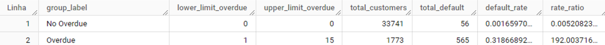

**Observações:**

🚩 Foi possível notar que clientes que atrasaram seus pagamentos foram mais inadimplentes.  
→ Clientes que atrasaram seus pagamentos apresentaram risco relativo de 192.00.

#### Código
```sql
WITH grupos AS (
    SELECT
        CASE
            WHEN more_90_days_overdue = 0 THEN 'No Overdue'
            ELSE 'Overdue'
        END AS group_label,
        more_90_days_overdue,
        default_flag
    FROM
        `riscorelativolab.join_tables.customer_info_and_total_loans_notNull`
),
total_clientes AS (
    SELECT
        group_label,
        COUNT(*) AS total_customers,
        SUM(default_flag) AS total_default,
        SUM(default_flag) / COUNT(*) AS default_rate
    FROM grupos
    GROUP BY group_label
),
default_rates AS (
    SELECT
        group_label,
        default_rate
    FROM total_clientes
)
SELECT
    g.group_label,
    MIN(g.more_90_days_overdue) AS lower_limit_overdue,
    MAX(g.more_90_days_overdue) AS upper_limit_overdue,
    t_c.total_customers,
    t_c.total_default,
    t_c.default_rate,
    CASE 
        WHEN g.group_label = 'No Overdue' THEN t_c.default_rate / (SELECT default_rate FROM default_rates WHERE group_label = 'Overdue')
        ELSE t_c.default_rate / (SELECT default_rate FROM default_rates WHERE group_label = 'No Overdue')
    END AS rate_ratio
FROM grupos g
JOIN total_clientes t_c ON g.group_label = t_c.group_label
GROUP BY g.group_label, t_c.total_customers, t_c.total_default, t_c.default_rate

```

### relative_risk_using_lines (variável using_lines_not_secured_personal_assets)

→ Variável using_lines_not_secured_personal_assets: Quanto o cliente está utilizando em relação ao seu limite de crédito, em linhas que não são garantidas por bens pessoais, como imóveis e automóveis

Tabela com dados sobre a divisão dos clientes por grupo de pessoas que usaram até 0.6 do limite de crédito e por grupo de pessoas que usaram mais que 0.6 do limite de crédito, dados sobre a taxa de inadimplência e sobre o risco relativo desses grupos:

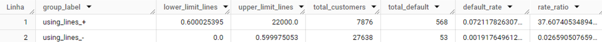

**Observações:**

🚩 Foi possível notar que os clientes que usaram mais limite de crédito foram mais inadimplentes.  
→ Os clientes que usaram mais de 0.60 do limite de crédito apresentaram risco relativo de 37.60.  
→ Os clientes que usaram até 0.59 do limite de crédito apresentaram risco relativo de 0.02.

#### Código
```sql
WITH grupos AS (
    SELECT
        CASE
            WHEN using_lines_not_secured_personal_assets > 0.6 THEN 'using_lines_+'
            ELSE 'using_lines_-'
        END AS group_label,
        using_lines_not_secured_personal_assets,
        default_flag
    FROM
        `riscorelativolab.join_tables.customer_info_and_total_loans_notNull`
),
total_clientes AS (
    SELECT
        group_label,
        COUNT(*) AS total_customers,
        SUM(default_flag) AS total_default,
        SUM(default_flag) / COUNT(*) AS default_rate
    FROM grupos
    GROUP BY group_label
),
default_rates AS (
    SELECT
        group_label,
        default_rate
    FROM total_clientes
)
SELECT
    g.group_label,
    MIN(g.using_lines_not_secured_personal_assets) AS lower_limit_lines,
    MAX(g.using_lines_not_secured_personal_assets) AS upper_limit_lines,
    t_c.total_customers,
    t_c.total_default,
    t_c.default_rate,
    CASE 
        WHEN g.group_label = 'using_lines_+' THEN t_c.default_rate / (SELECT default_rate FROM default_rates WHERE group_label = 'using_lines_-')
        ELSE t_c.default_rate / (SELECT default_rate FROM default_rates WHERE group_label = 'using_lines_+')
    END AS rate_ratio
FROM grupos g
JOIN total_clientes t_c ON g.group_label = t_c.group_label
GROUP BY g.group_label, t_c.total_customers, t_c.total_default, t_c.default_rate
```

### relative_risk_debt_ratio (variável debt_ratio)

→ Variável debt_ratio: Relação entre dívidas e ativos do cliente. Taxa de endividamento = Dívidas / Patrimônio  

Tabela com dados sobre a divisão dos clientes por grupo de pessoas com taxa de endividamento < 0 e por grupo de pessoas com taxa de endividamento > 0, dados sobre a taxa de inadimplência e sobre o risco relativo desses grupos:

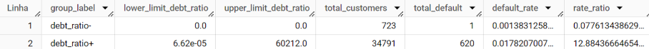

**Observações:**

🚩 Foi possível notar que os clientes com taxa de endividamento maior que 0 foram mais inadimplentes.

#### Código
```sql
WITH grupos AS (
    SELECT
        CASE
            WHEN debt_ratio > 0 THEN 'debt_ratio+'
            ELSE 'debt_ratio-'
        END AS group_label,
        debt_ratio,
        default_flag
    FROM
        `riscorelativolab.join_tables.customer_info_and_total_loans_notNull`
),
total_clientes AS (
    SELECT
        group_label,
        COUNT(*) AS total_customers,
        SUM(default_flag) AS total_default,
        SUM(default_flag) / COUNT(*) AS default_rate
    FROM grupos
    GROUP BY group_label
),
default_rates AS (
    SELECT
        group_label,
        default_rate
    FROM total_clientes
)
SELECT
    g.group_label,
    MIN(g.debt_ratio) AS lower_limit_debt_ratio,
    MAX(g.debt_ratio) AS upper_limit_debt_ratio,
    t_c.total_customers,
    t_c.total_default,
    t_c.default_rate,
    CASE 
        WHEN g.group_label = 'debt_ratio+' THEN t_c.default_rate / (SELECT default_rate FROM default_rates WHERE group_label = 'debt_ratio-')
        ELSE t_c.default_rate / (SELECT default_rate FROM default_rates WHERE group_label = 'debt_ratio+')
    END AS rate_ratio
FROM grupos g
JOIN total_clientes t_c ON g.group_label = t_c.group_label
GROUP BY g.group_label, t_c.total_customers, t_c.total_default, t_c.default_rate
```

## Hipóteses

📌 Os mais jovens correm um risco maior de não pagamento  
- A faixa etária de 21 a 42 anos apresentou risco relativo de 2.27.  
- A faixa etária de 42 a 52 anos apresentou risco relativo de 1.33.  
- Clientes com idade acima de 52 anos apresentaram risco relativo de até 0.68. Nos casos de clientes com idade acima de 63 anos, o risco relativo diminuiu para 0.24.  

📌 Pessoas com mais empréstimos ativos correm maior risco de serem maus pagadores  
- Clientes com total de empréstimos entre 1 e 5 apresentaram risco relativo de 2.06.
- Clientes com total de empréstimos entre 5 e 8 apresentaram risco relativo de 1.01.
- Clientes com mais de 8 empréstimos apresentaram risco relativo entre 0.60 e 0.62.  

📌 Pessoas que atrasaram seus pagamentos por mais de 90 dias correm maior risco de serem maus pagadores
- Clientes que atrasaram seus pagamentos apresentaram risco relativo de 192.00.
- Clientes que não atrasaram seus pagamentos apresentaram risco relativo de 0.005.

### Insights sobre as hipóteses:

- A faixa etária mais jovem (21-42 anos) é a de maior risco, enquanto clientes mais velhos (especialmente acima de 63 anos) têm significativamente menor risco.
- Ter um número moderado de empréstimos (1-5) está associado a um risco elevado, mas um número muito alto de empréstimos (>8) parece estar relacionado a um menor risco relativo.
- O fator mais crítico é o comportamento de pagamento. Clientes que atrasam seus pagamentos por mais de 90 dias têm um risco extremamente alto, enquanto aqueles que não atrasaram por mais de 90 dias têm um risco quase inexistente.

## Segmentação

A partir da análise do risco relativo, foi elaborada uma pontuação de risco de inadimplência para os clientes. A pontuação para cada variável variou entre 0 e 1 ou 0 e 2, a depender da variável. De modo que, quanto maior o risco relativo, maior a pontuação de risco do cliente. Ao final, essas pontuações foram somadas para gerar um total da pontuação de risco para cada cliente.

### Pontuações atribuídas

Grupo                                     | Pontuação
------------------------------------------|-----------
Idade ≥ 21 e ≤ 42                         | 1
Idade ≥ 42 e ≤ 52                         | 1
Idade ≥ 52 e ≤ 63                         | 0
Idade ≥ 63 e ≤ 92                         | 0
Número de dependentes < 2                 | 0
Número de dependentes ≥ 2                 | 1
Último salário mensal ≤ 3948.0            | 1
Último salário mensal ≥ 3949.0 e ≤ 5416.0 | 1
Último salário mensal ≥ 5416.0 e ≤ 7499.0 | 0
Último salário mensal ≥ 7500.0            | 0
Total de empréstimos ≥ 1 e ≤ 5            | 1
Total de empréstimos ≥ 5 e ≤ 8            | 1
Total de empréstimos ≥ 8 e ≤ 11           | 0
Total de empréstimos ≥ 11 e ≤ 57          | 0
Atraso nos pagamentos = 0                 | 0
Atraso nos pagamentos > 0                 | 2
Uso do limite de crédito < 0.60           | 0
Uso do limite de crédito ≥ 0.60           | 2
Taxa de endividamento ≤ 0                 | 0
Taxa de endividamento > 0                 | 2


**Observações:**

As variáveis com maior risco relativo foram: more_90_days_overdue, using_lines_not_secured_personal_assets, debt_ratio.


Variável: more_90_days_overdue  


Variável: using_lines_not_secured_personal_assets


Variável: debt_ratio

Ao analisar esses valores, é possível concluir, de maneira geral, que clientes que atrasaram o pagamento por mais de 90 dias, que usaram mais o seu limite de crédito (em linhas que não são garantidas por bens pessoais), e que possuíam uma taxa de endividamento maior do que 0, foram mais inadimplentes. Por isso, esses clientes receberam uma pontuação mais alta de risco para essas variáveis (pontuação 2). Para as demais variáveis, o peso variou entre 0 e 1.

### Foram feitos 2 tipos de segmentação

→ 1ª segmentação: Segmentação considerando o peso das variáveis age, number_dependents, last_month_salary_median, total_loans, more_90_days_overdue, using_lines_not_secured_personal_assets e debt_ratio.

→ 2ª segmentação: Segmentação considerando apenas o peso das variáveis more_90_days_overdue, using_lines_not_secured_personal_assets e debt_ratio.

#### Conclusões | 1ª segmentação

→ Essa segmentação foi feita considerando o peso das variáveis age, number_dependents, last_month_salary_median, total_loans, more_90_days_overdue, using_lines_not_secured_personal_assets e debt_ratio.

→ Análise feita a partir dos dados da tabela risk_score.

**Pontuação de risco para clientes adimplentes**

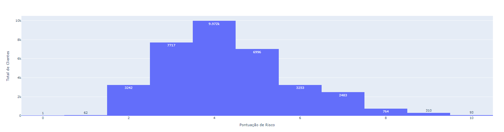

**Pontuação de risco para clientes inadimplentes**
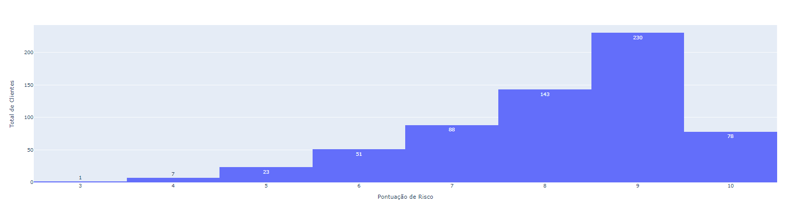

Dentre os 621 clientes que já foram inadimplentes, 539 (86.79%) se concentraram nas pontuações entre 7 e 10. Enquanto que, dentre os 34893 clientes adimplentes, apenas 3650 (10.46%) se concentraram nas pontuações entre 7 e 10. Considerando que quanto maior o risco relativo nas diferentes variáveis, maior a pontuação de risco do cliente, e observando que a maior parte dos clientes que já foram inadimplentes se concentraram nas pontuações entre 7 e 10; optei por estabelecer que, a partir da pontuação de risco 7, os clientes seriam considerados como clientes com maior risco de inadimplência.

**Matriz de confusão**
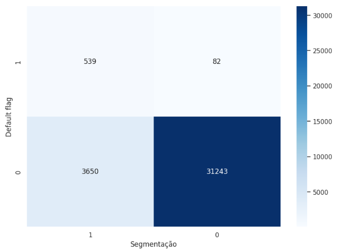  
Métricas:  Acurácia: 0.8949  |  Precisão: 0.1287  |  Recall: 0.8680  |  F1-Score: 0.2241

#### Conclusões | 2ª segmentação

→ Essa segmentação foi feita considerando apenas o peso das variáveis more_90_days_overdue, using_lines_not_secured_personal_assets e debt_ratio.  
→ Análise feita a partir dos dados da tabela risk_score_2.  

As variáveis com maior risco relativo foram: more_90_days_overdue, using_lines_not_secured_personal_assets, debt_ratio.  


Variável: more_90_days_overdue  


Variável: using_lines_not_secured_personal_assets


Variável: debt_ratio

**Pontuação de risco para clientes adimplentes**


**Pontuação de risco para clientes inadimplentes**
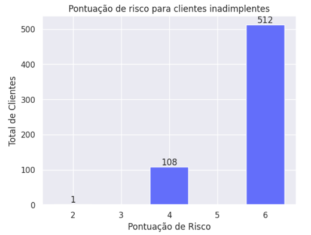

Dentre os 621 clientes que já foram inadimplentes, 512 (82.44%) se concentraram na pontuação 6. Enquanto que, dentre os 34893 clientes adimplentes, apenas 682 (1.95%) se concentraram na pontuação 6. Considerando que quanto maior o risco relativo nas diferentes variáveis, maior a pontuação de risco do cliente, e observando que a maior parte dos clientes que já foram inadimplentes se concentraram na pontuação 6; optei por estabelecer que, a partir da pontuação de risco 6, os clientes seriam considerados como clientes com maior risco de inadimplência.

**Matriz de confusão**

  
Métricas:  Acurácia: 0.9777  |  Precisão: 0.4288  |  Recall: 0.8245  |  F1-Score: 0.5642

#### Análise | 1ª segmentação e 2ª segmentação
**1ª segmentação**

- Dentre os 621 clientes que já foram inadimplentes:
    - 539 (86.79%) foram classificados corretamente como inadimplentes.
    - 82 (13.20%) foram classificados incorretamente como adimplentes.
- Dentre os 34893 clientes adimplentes:
    - 31243 (89.53%) foram classificados corretamente como adimplentes.
    - 3650 (10.46%) foram classificados incorretamente como inadimplentes.

**2ª segmentação**

- Dentre os 621 clientes que já foram inadimplentes:
    - 512 (82.44%) foram classificados corretamente como inadimplentes.
    - 109 (17.55%) foram classificados incorretamente como adimplentes.
- Dentre os 34893 clientes adimplentes:
    - 34211 (98.04%) foram classificados corretamente como adimplentes.
    - 682 (1.95%) foram classificados incorretamente como inadimplentes.

Na 1ª segmentação o Recall foi mais alto (0.8680) em comparação com o Recall da 2ª segmentação (0.8245), embora a diferença seja pequena. Contudo, na 2ª segmentação, apenas 1.95% dos clientes adimplentes foram classificados incorretamente como inadimplentes. Pensando nisso, optei por dar prioridade para a 2ª segmentação, pois, a diferença de Recall entre as duas segmentações é pequena, o F1-Score da 2ª segmentação foi mais alto (0.5642) em comparação com o F1-Score da 1ª segmentação (0.2241), e na 2ª segmentação ocorreram menos erros de classificação dos clientes adimplentes.

## Regressão Logística

Foram utilizadas técnicas de regressão logística para prever a inadimplência de clientes e comparar a eficácia dessas previsões com as pontuações de risco fornecidas. O objetivo é avaliar se as pontuações de risco categorizam os clientes de maneira similar aos dados 'brutos' e identificar sua capacidade de distinguir entre clientes com maior ou menor risco de inadimplência. Foram feitas 4 análises:

- [1ª) Treinar o modelo com os dados da tabela risk_score, usando as variáveis 'risk_age', 'risk_dependents', 'risk_salary', 'risk_loans', 'risk_overdue', 'risk_lines_not_secured', 'risk_debt_ratio' como variáveis explicativas.](#1ª-análise-treinar-o-modelo-com-os-dados-da-tabela-risk_score)
- [2ª) Treinar o modelo com os dados da tabela risk_score_2, usando as variáveis 'risk_overdue', 'risk_lines_not_secured', 'risk_debt_ratio' como variáveis explicativas.](#2ª-análise-treinar-o-modelo-com-os-dados-da-tabela-risk_score_2)
- [3ª) Treinar o modelo com os dados da tabela customer_info_and_total_loans_notNull, usando as variáveis 'age', 'number_dependents', 'last_month_salary_median', 'total_loans', 'more_90_days_overdue', 'using_lines_not_secured_personal_assets', 'debt_ratio' como variáveis explicativas.](#3ª-análise-treinar-o-modelo-com-os-dados-da-tabela-customer_info_and_total_loans_notnull-versão-1)
- [4ª) Treinar o modelo com os dados da tabela customer_info_and_total_loans_notNull, usando as variáveis 'more_90_days_overdue', 'using_lines_not_secured_personal_assets', 'debt_ratio' como variáveis explicativas.](#4ª-análise-treinar-o-modelo-com-os-dados-da-tabela-customer_info_and_total_loans_notnull-versão-2)
- [Considerações Finais](#considerações-finais)

→ Em todos os casos, foram aplicadas as técnicas de undersampling e oversampling, pois as classes estavam muito desbalanceadas (621 clientes inadimplentes vs. 34893 clientes adimplentes).

### 1ª Análise: Treinar o modelo com os dados da tabela risk_score

Foi feita uma regressão logística para avaliar o quanto o modelo seria capaz de prever os clientes que já foram inadimplentes a partir da pontuação de risco atribuída para as variáveis 'risk_age', 'risk_dependents', 'risk_salary', 'risk_loans', 'risk_overdue', 'risk_lines_not_secured', 'risk_debt_ratio'.

Inicialmente, a acurácia do modelo foi 0.98, mas o modelo não foi eficaz em identificar clientes verdadeiramente inadimplentes, com um Recall de 0.1366. Dentre 205 clientes que verdadeiramente já foram inadimplentes, apenas 28 foram previstos como inadimplentes pelo modelo.


**Undersampling**

---

Após aplicar a técnica de undersampling, observou-se que a precisão caiu de 0.5714 para 0.3357. Contudo, o Recall melhorou significativamente, subindo de 0.1366 para 0.9122. Com isso, o F1-Score também melhorou, subindo de 0.2205 para 0.4908.

Após o undersampling, o modelo errou mais na previsão dos clientes adimplentes, contudo, passou a acertar mais na previsão dos clientes inadimplentes:

- Dentre 205 clientes que verdadeiramente já foram inadimplentes, 18 clientes foram previstos incorretamente como adimplentes.
- Dentre 10450 clientes verdadeiramente adimplentes, 370 foram previstos incorretamente como inadimplentes.

Dentre 205 clientes que verdadeiramente já foram inadimplentes, 187 foram previstos como inadimplentes pelo modelo, e apenas 18 foram previstos incorretamente como adimplentes.

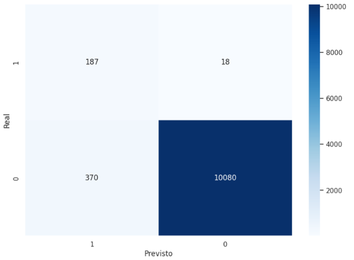

**Oversampling**

---

Após aplicar a técnica de oversamplig, a precisão caiu de 0.33 para 0.30, o Recall caiu de 0.9122 para 0.8976, de modo que, o F1-Score também caiu de 0.4908 para 0.4549.

Após o oversampling, o modelo errou mais na identificação dos inadimplentes e dos adimplentes:

- Dentre 205 clientes que verdadeiramente já foram inadimplentes, 21 clientes foram previstos incorretamente como adimplentes.
- Dentre 10450 clientes verdadeiramente adimplentes, 420 foram previstos incorretamente como inadimplentes.

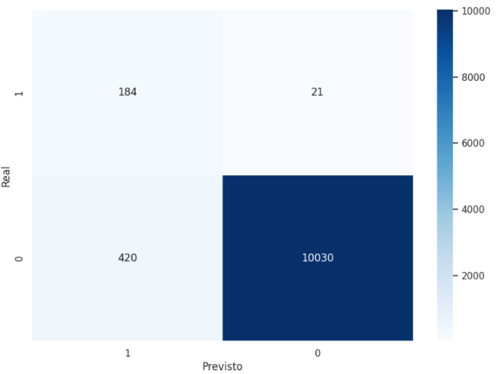

**Conclusões**

---

O modelo apresentou melhor performance após a aplicação do undersampling, pois as classes estavam muito desbalanceadas. Ao analisar o Recall dessa performance (0.9122), é possível chegar à conclusão que as pontuações de risco atribuídas para as variáveis 'risk_age', 'risk_dependents', 'risk_salary', 'risk_loans', 'risk_overdue', 'risk_lines_not_secured', 'risk_debt_ratio' foram satisfatórias para que o modelo pudesse prever com uma boa taxa de acertos (91.21% do total de 205 clientes inadimplentes) clientes que já foram inadimplentes.

### 2ª Análise: Treinar o modelo com os dados da tabela risk_score_2

Sabendo que as variáveis  more_90_days_overdue, using_lines_not_secured_personal_assets, e debt_ratio apresentaram riscos relativos muito maiores do que as outras variáveis (age, number_dependents, last_month_salary_median e total_loans), foi feita uma regressão logística utilizando apenas essas 3 variáveis como variáveis explicativas. O objetivo foi avaliar o quanto o modelo seria capaz de prever os clientes que já foram inadimplentes apenas com a pontuação de risco atribuída para as variáveis 'risk_overdue', 'risk_lines_not_secured', 'risk_debt_ratio'.

Como o modelo tinha menos dados para prever os clientes que já foram inadimplentes e as classes estavam muito desbalanceadas, o modelo acertou todos os clientes adimplentes e errou todos os clientes inadimplentes.

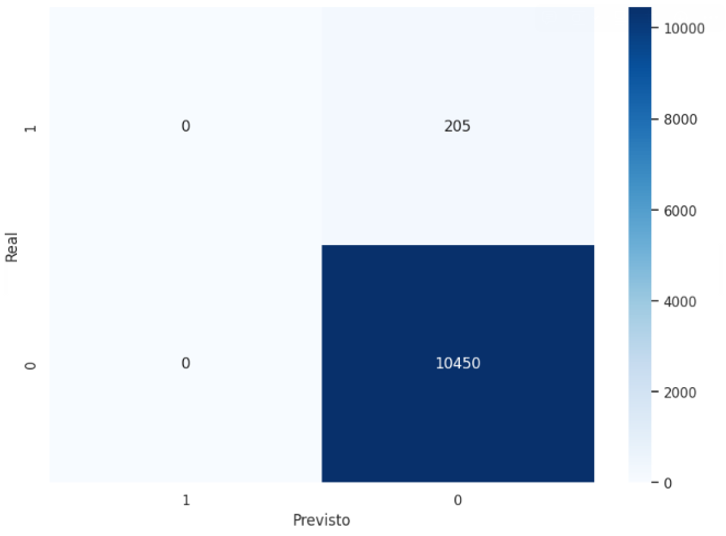

**Undersampling**

---

Após aplicar a técnica de undersampling, as métricas obtidas foram:

| Métrica | Valor |
| --- | --- |
| Acurácia | 0.9648 |
| Precisão | 0.3438 |
| Recall | 0.9122 |
| F1-Score | 0.4993  |

Após o undersampling, o modelo errou mais na previsão dos clientes adimplentes, contudo, passou a acertar mais na previsão dos clientes inadimplentes:

- Dentre 205 clientes que verdadeiramente já foram inadimplentes, 18 clientes foram previstos incorretamente como adimplentes.
- Dentre 10450 clientes verdadeiramente adimplentes, 370 foram previstos incorretamente como inadimplentes.


**Oversampling**

---

As métricas obtidas após o oversamplig foram idênticas às métricas obtidas após o undersampling, pois as matrizes de confusão obtidas foram iguais, embora o y_proba tenha sido ligeiramente diferente. Assim, a conclusão foi que a performance do modelo foi idêntica tanto no undersampling como no oversampling.

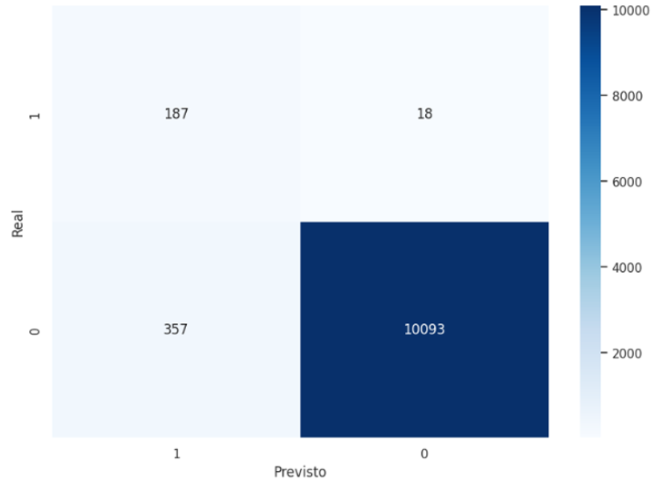

**Conclusões**

---

O modelo apresentou melhor performance após a aplicação do undersampling, pois as classes estavam muito desbalanceadas. O Recall dessa performance (0.9122) foi igual ao Recall da 1ª análise (após a aplicação do undersampling). Contudo, nessa performance, o modelo errou menos a previsão dos clientes adimplentes, errando apenas 3.41% do total de clientes adimplentes (10450) em comparação com a performance da 1ª análise (após a aplicação do undersampling), na qual o modelo errou 3.54%  do total de clientes adimplentes (10450). Esses dados corroboram com a análise da 1ª segmentação e 2ª segmentação.

Dessa forma, é possível chegar à conclusão que as pontuações de risco atribuídas para as variáveis 'risk_overdue', 'risk_lines_not_secured', 'risk_debt_ratio' foram satisfatórias para que o modelo pudesse prever com uma boa taxa de acertos (91.21% do total de 205 clientes inadimplentes) clientes que já foram inadimplentes.

### 3ª Análise: Treinar o modelo com os dados da tabela customer_info_and_total_loans_notNull (versão 1)

Foi feita uma regressão logística para avaliar o quanto o modelo seria capaz de prever os clientes que já foram inadimplentes a partir dos valores “brutos” das variáveis 'age', 'number_dependents', 'last_month_salary_median', 'total_loans', 'more_90_days_overdue', 'using_lines_not_secured_personal_assets', 'debt_ratio'.

As métricas obtidas foram:

| Métrica | Valor |
| --- | --- |
| Acurácia | 0.9848 |
| Precisão | 0.7792 |
| Recall | 0.2927 |
| F1-Score | 0.4255 |

→ O recall está baixo, o modelo não é eficaz em identificar clientes verdadeiramente inadimplentes.


**Undersampling**

---

Após aplicar a técnica de undersampling, as métricas obtidas foram:

| Métrica | Valor |
| --- | --- |
| Acurácia | 0.9634 |
| Precisão | 0.3345 |
| Recall | 0.9122 |
| F1-Score | 0.4895 |

Após o undersampling, o modelo errou mais na previsão dos clientes adimplentes, contudo, passou a acertar mais na previsão dos clientes inadimplentes:

- Dentre 205 clientes que verdadeiramente já foram inadimplentes, 18 clientes foram previstos incorretamente como adimplentes.
- Dentre 10450 clientes verdadeiramente adimplentes, 372 foram previstos incorretamente como inadimplentes.

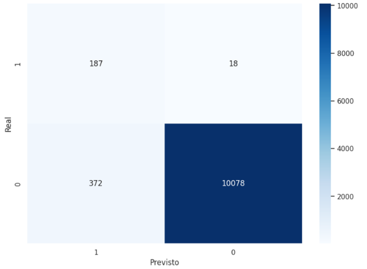

**Oversampling**

---

Após aplicar a técnica de oversampling, as métricas obtidas foram:

| Métrica | Valor |
| --- | --- |
| Acurácia | 0.9651 |
| Precisão | 0.3457 |
| Recall | 0.9122 |
| F1-Score | 0.5013 |

A precisão subiu de 0.3345 para 0.3457, mas o . Ao observar a matriz de confusão, é possível notar que o modelo errou menos na previsão do clientes adimplentes, de modo que, a precisão subiu de 0.3345 para 0.3457. Porém, o Recall permaneceu igual, pois, o modelo manteve a mesma taxa de erros na previsão dos clientes inadimplentes, classificando apenas 8.78% dos clientes inadimplentes como adimplentes.


**Conclusões**

---

O modelo apresentou melhor performance após a aplicação do oversampling, pois as classes estavam muito desbalanceadas.

### 4ª Análise: Treinar o modelo com os dados da tabela customer_info_and_total_loans_notNull (versão 2)

Foi feita uma regressão logística para avaliar o quanto o modelo seria capaz de prever os clientes que já foram inadimplentes a partir dos valores “brutos” das variáveis 'more_90_days_overdue', 'using_lines_not_secured_personal_assets', 'debt_ratio'.

As métricas obtidas foram:

| Acurácia | 0.9847 |
| --- | --- |
| Precisão | 0.7692 |
| Recall | 0.2927 |
| F1-Score | 0.4240 |

Assim como nos passos anteriores, o modelo se mostrou muito bom para prever os clientes adimplentes, mas ruim para prever os clientes inadimplentes.


**Undersampling**

---

Após aplicar a técnica de undersampling, as métricas obtidas foram:

| Métrica | Valor
| --- | --- |
| Acurácia | 0.9648 |
| Precisão | 0.3438 |
| Recall | 0.9122 |
| F1-Score | 0.4993 |

Após o undersampling, o modelo errou mais na previsão dos clientes adimplentes, contudo, passou a acertar mais na previsão dos clientes inadimplentes:

- Dentre 205 clientes que verdadeiramente já foram inadimplentes, 18 clientes foram previstos incorretamente como adimplentes.
- Dentre 10450 clientes verdadeiramente adimplentes, 357 foram previstos incorretamente como inadimplentes.


**Oversampling**

---

As métricas obtidas após o oversamplig foram idênticas às métricas obtidas após o undersampling, pois as matrizes de confusão obtidas foram iguais, embora o y_proba tenha sido ligeiramente diferente. Assim, a conclusão foi que a performance do modelo foi idêntica tanto no undersampling como no oversampling.


**Conclusões**

---

O modelo apresentou melhor performance após a aplicação do undersampling, pois as classes estavam muito desbalanceadas. O Recall da 4ª análise foi idêntico ao Recall da 3ª análise, mas ao analisar a matriz de confusão, podemos notar que na 4ª análise (após o oversampling), o modelo errou mais na previsão dos clientes adimplentes, classificando erroneamente 3.41% dos clientes adimplentes como inadimplentes. Já na 3ª análise, em que o modelo contava com mais variáveis explicativas, ele classificou erroneamente 3.38% dos clientes adimplentes como inadimplentes. Embora exista uma diferença entre as taxas de erros da 3ª análise e da 4ª análise, essa diferença é muito pequena.

### Considerações Finais

Quando o modelo de regressão logística foi utilizado a fim de prever os clientes que já foram inadimplentes por meio de variáveis explicativas binárias (pontuações), o modelo performou ligeiramente melhor usando apenas as variáveis 'risk_overdue', 'risk_lines_not_secured', 'risk_debt_ratio' (2ª Análise) para fazer a previsão. Pois, na 2ª Análise, o modelo errou apenas 3.41% do total de clientes adimplentes (10450) em comparação com a performance da 1ª análise (após a aplicação do undersampling), na qual o modelo errou 3.54% do total de clientes adimplentes (10450). 

Contudo, quando o modelo foi utilizado a fim de prever os clientes que já foram inadimplentes por meio dos dados “brutos” das variáveis 'age', 'number_dependents', 'last_month_salary_median', 'total_loans', 'more_90_days_overdue', 'using_lines_not_secured_personal_assets', e 'debt_ratio' (3ª Análise), o modelo apresentou uma performance ligeiramente melhor do que quando foi submetido a fazer a previsão apenas com os dados “brutos” das variáveis 'more_90_days_overdue', 'using_lines_not_secured_personal_assets', e 'debt_ratio' (4ª análise). Pois, na 4ª análise (após o oversampling), o modelo errou mais na previsão dos clientes adimplentes, classificando erroneamente 3.41% dos clientes adimplentes como inadimplentes. Já na 3ª análise, em que o modelo contava com mais variáveis explicativas, ele classificou erroneamente 3.38% dos clientes adimplentes como inadimplentes.

A conclusão geral foi que os modelos performaram melhor após aplicação das técnicas de reamostragem (undersampling e oversampling), pois as classes estavam muito desbalanceadas. Embora essa análise seja limitada devido ao baixo número de clientes verdadeiramente inadimplentes em comparação com os clientes adimplentes, foi possível perceber que os dados utilizados nas variáveis explicativas foram escolhidos de forma acertada e foram suficientes para que o modelo pudesse prever de forma satisfatória os clientes que já foram inadimplentes. Revelando que a partir dos dados de idade, número de dependentes, último salário do mês, total de empréstimos, atraso por mais de 90 dias, uso do limite de crédito (em linhas que não são garantidas por bens pessoais) e taxa de endividamento foi possível prever os clientes que já foram inadimplentes, com uma pequena taxa de erro (a depender da técnica utilizada).

Assim como, foi possível prever os clientes que já foram inadimplentes (com uma pequena taxa de erro a depender da técnica utilizada), por meio das pontuações atribuídas para as variáveis 'risk_overdue', 'risk_lines_not_secured', 'risk_debt_ratio'. Revelando que, as pontuações de risco para o atraso por mais de 90 dias, o uso do limite de crédito (em linhas que não são garantidas por bens pessoais) e a taxa de endividamento, foram atribuídas de maneira acertada e foram suficientes (ao comparar com os outros modelos analisados) para prever os clientes que já foram inadimplentes.

De maneira geral, todos os modelos utilizados (após aplicação das técnicas de reamostragem) apresentaram uma performance satisfatória; mas, para fins de segmentação, optei por segmentar os clientes no que se refere ao risco de inadimplência a partir das pontuações atribuídas para as variáveis 'risk_overdue', 'risk_lines_not_secured', 'risk_debt_ratio', pontuações que se mostraram suficientes para realizar a segmentação dos clientes com maior risco de inadimplência. De modo que, considerando essa segmentação ([Conclusões | 2ª segmentação](#conclusões--2ª-segmentação)), clientes com pontuação de risco igual a 6 serão classificados como clientes com maior risco de inadimplência.

## Análise Exploratória

Logo e Cores no Figma: [https://www.figma.com/design/nCK814SyHnveuEGEIaSpgd/Untitled?node-id=0-1&t=TaojqpVapHvdCctv-1](https://www.figma.com/design/nCK814SyHnveuEGEIaSpgd/Untitled?node-id=0-1&t=TaojqpVapHvdCctv-1) 

Dashboard: [https://lookerstudio.google.com/reporting/789f2de1-bc5c-4de6-878f-d3f385a91191](https://lookerstudio.google.com/reporting/789f2de1-bc5c-4de6-878f-d3f385a91191)

### Grupos Etários

A amostra apresenta um certo equilíbrio no que se refere à divisão por faixas etárias. 

| Porcentagem | Grupos | Risco de Inadimplência | Risco Relativo |
| ----------- | ------ | ---------------------- | -------------- |
| 24.89% | Clientes entre 21 e 41 anos de idade | maior risco | 2.27 |
| 26.31% | Clientes entre 42 e 52 anos de idade | maior risco | 1.33 |
| 25.80% | Clientes entre 53 e 63 anos de idade | menor risco | 0.68 |
| 22.97% | Clientes entre 64 e 92 anos de idade | menor risco | 0.24 |

Na análise de risco relativo foi constatado que pessoas com idade entre 21 e 52 anos apresentaram risco de inadimplência maior, esse risco variou entre 1.33 e 2.27. Ao analisar a amostra de clientes adimplentes, foi possível perceber que esse grupo é apenas um pouco maior em quantidade, sendo 52.15% do total de clientes adimplentes. Contudo, ao analisar a amostra de clientes inadimplentes, notou-se que esse grupo representa 75.04% do total de clientes inadimplentes.

Total de todos os clientes por faixa etária  
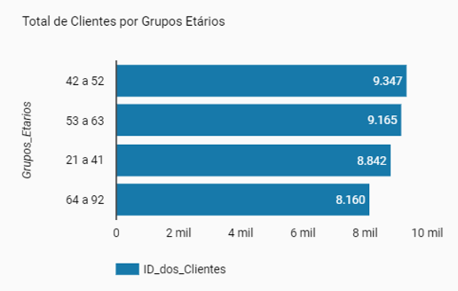 

Total de clientes adimplentes por faixa etária  


Total de clientes inadimplentes por faixa etária  
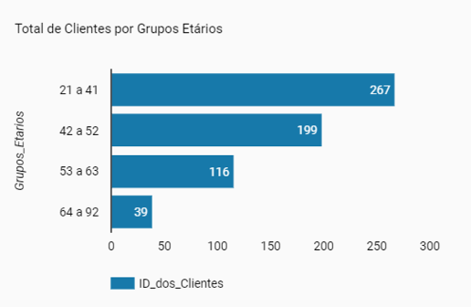

### Último Salário Mensal

A amostra apresenta um maior número de pessoas que receberam até 5416, sendo 59.88% do total de clientes.

| Porcentagem | Grupos | Risco de Inadimplência | Risco Relativo |
| ----------- | ------ | ---------------------- | -------------- |
| 25.00% | Entre 0 e 3948 | maior risco | 1.95 |
| 34.88% | Entre 3949 e 5416 | maior risco | 1.24 |
| 15.11% | Entre 5417 e 7499 | menor risco | 0.73 |
| 24.99% | Entre 7500 e 730483 | menor risco | 0.39 |

De acordo com a análise de risco de inadimplência, pessoas com salários menores apresentaram maior risco de inadimplência. Dentre os clientes adimplentes, pessoas que receberam até 5416 são a maioria, sendo 60.13% do total de clientes adimplentes. Já entre os clientes inadimplentes,  pessoas que receberam até 5416 representam 73.59% do total; uma porcentagem maior em comparação com o grupo de inadimplentes, mas com uma diferença pequena.

Total de todos os clientes por faixas de último salário mensal  
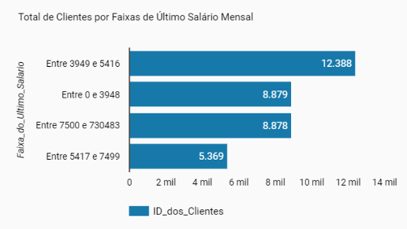

Total clientes adimplentes por faixas de último salário mensal  
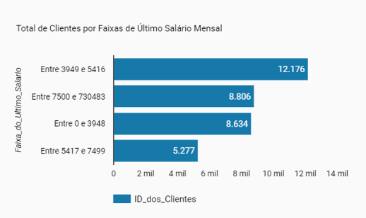

Total clientes inadimplentes por faixas de último salário mensal  
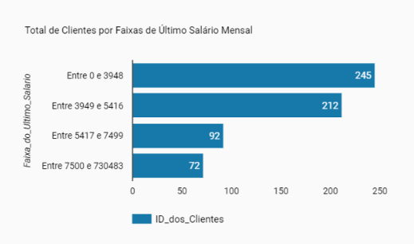

### Número de Dependentes

Na amostra, 77.79% do total de clientes têm até 1 dependente, sendo o grupo que apresentou o menor risco relativo para inadimplência.

| Porcentagem | Grupos | Risco de Inadimplência | Risco Relativo |
| --- | --- | --- | --- |
| 77.79% | Clientes com até 1 dependente | menor risco | 0.64 |
| 22.20% | Clientes com 2 ou mais dependentes | maior risco | 1.55 |

Dentre o total de clientes adimplentes, clientes com 2 ou mais dependentes representam 22.05% do total. Enquanto que, dentre os clientes inadimplentes, clientes com 2 ou mais dependentes representam 30.75%. Podemos notar que, embora exista um percentual maior de pessoas com 2 ou mais dependentes no grupo de pessoas inadimplentes, a diferença desse percentual entre os grupos é pequena.

### Situação Financeira

A amostra conta com um total significativamente maior de pessoas adimplentes, sendo 98.25% do total de clientes. Dentre esses clientes adimplentes, apenas 3.46% já atrasaram seus pagamentos por mais de 90 dias, 97.93% possuem taxa de endividamento maior que 0, 20.94% usou o limite de crédito por linhas que não são garantidas por bens pessoais, e 11.94% dos empréstimos que realizaram foram do tipo imobiliário. 

Dentre os clientes inadimplentes, que representam 1.74% do total de clientes, 90.98% já atrasaram seus pagamentos por mais de 90 dias, 99.83% possuem taxa de endividamento maior que 0, 91.46% usou o limite de crédito por linhas que não são garantidas por bens pessoais, e 11.73%  dos empréstimos que realizaram foram do tipo imobiliário. 

Analisando esses dados, podemos notar que no tocante à diferença entre adimplentes e inadimplentes, as variáveis que mais se destacam são o percentual de atraso dos pagamentos por mais de 90 dias e o uso do limite de crédito por linhas que não são garantidas por bens pessoais. 

Vejamos em formato de tabela:

Situação Financeira | Total de Clientes | Atraso no Pagamento | Taxa de Endividamento | Uso do Limite de Crédito | Tipo de Empréstimo |
| --- | --- | --- | --- | --- | --- |
| Adimplentes | 98.25% do total de clientes | 3.46% já atrasaram seus pagamentos por mais de 90 dias | 97.93% possuem taxa de endividamento maior que 0 | 20.94% usou mais que 0.60 do limite de crédito por linhas que não são garantidas por bens pessoais | 11.94% dos empréstimos que realizaram foram do tipo imobiliário |
| Inadimplentes | 1.74% do total de clientes | 90.98% já atrasaram seus pagamentos por mais de 90 dias | 99.83% possuem taxa de endividamento maior que 0 | 91.46% usou mais que 0.60 do limite de crédito por linhas que não são garantidas por bens pessoais | 11.73%  dos empréstimos que realizaram foram do tipo imobiliário |

→ Entre os clientes adimplentes, apenas 3.46% já enfrentaram atrasos superiores a 90 dias. Em contraste, uma esmagadora maioria de 90.98% dos clientes inadimplentes teve histórico de atrasos prolongados. Essa diferença notável indica que o histórico de atrasos prolongados é um forte indicador de inadimplência. Clientes que conseguem manter seus pagamentos dentro do prazo têm uma probabilidade significativamente maior de se manterem adimplentes.

→ O uso de crédito não garantido por bens pessoais é marcadamente mais alto entre os clientes inadimplentes, com 91.46% deles utilizando esse tipo de crédito. Em comparação, apenas 20.94% dos clientes adimplentes fazem uso deste recurso. Essa disparidade sugere que o recurso ao crédito não garantido está associado a um maior risco de inadimplência. Clientes que dependem de crédito não garantido podem estar em situações financeiras mais precárias ou gerenciando suas finanças de maneira mais arriscada.

Podemos chegar à conclusão que, o histórico de atrasos longos nos pagamentos e o uso de crédito não garantido são as variáveis mais críticas na distinção entre clientes adimplentes e inadimplentes. O banco Super Caja pode focar nessas áreas para avaliar o risco de inadimplência. Monitorar atrasos prolongados e o uso excessivo de crédito não garantido pode ser essencial para identificar clientes em potencial risco e implementar estratégias preventivas eficazes. Assim como, é importante olhar para a taxa de endividamento, uma vez que, a análise de risco relativo para a inadimplência mostrou que clientes com taxa de endividamento maior que 0 apresentam risco relativo de 12.88, enquanto que clientes com taxa de endividamento menor que 0 apresentam risco relativo de apenas 0.07.

### Score de Risco de Inadimplência

Quanto à pontuação por risco de inadimplência, que variou entre 2 e 6, a maioria dos clientes ficou entre a pontuação 2 e 4. Esse cenário se repetiu no grupo de adimplentes, em que 76.53% pontuaram 2 e 19.96% pontuaram 4.

No grupo de pessoas que já foram inadimplentes, a pontuação de risco variou entre 6 e 4, 82.44%  pontuaram 6 e 17.39% pontuaram 4.

Essa distribuição está alinhada com a análise de que clientes que já foram inadimplentes tendem a ter uma pontuação de risco mais alta para atrasos nos pagamentos por mais de 90 dias, para o uso de crédito não garantido por bens pessoais, e para taxa de endividamento. Validando  importância de monitorar essas variáveis para prever o risco de inadimplência, tomar decisões informadas sobre a quem conceder crédito, e reduzir o risco de empréstimos não reembolsáveis.

Distribuição dos clientes adimplentes por pontuação de risco de inadimplência
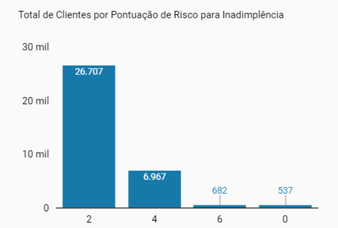

Distribuição dos clientes inadimplentes por pontuação de risco de inadimplência
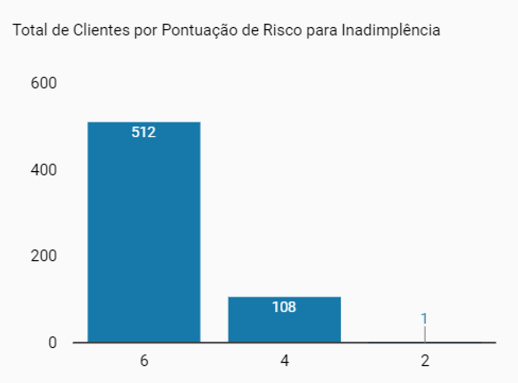

## Links Importantes

📍 Para acessar o projeto com a logo e as cores no Figma, [clique aqui](https://www.figma.com/design/nCK814SyHnveuEGEIaSpgd/Untitled?node-id=0-1&t=TaojqpVapHvdCctv-1).

📍 Para acessar o dashboard do projeto, [clique aqui](https://lookerstudio.google.com/reporting/789f2de1-bc5c-4de6-878f-d3f385a91191).

📍 Para acessar o notebook no Google Colab, [clique aqui](https://colab.research.google.com/drive/1ioOjE1dbrBc6FtihS5xDqP6dr0jq97xU?usp=sharing).
